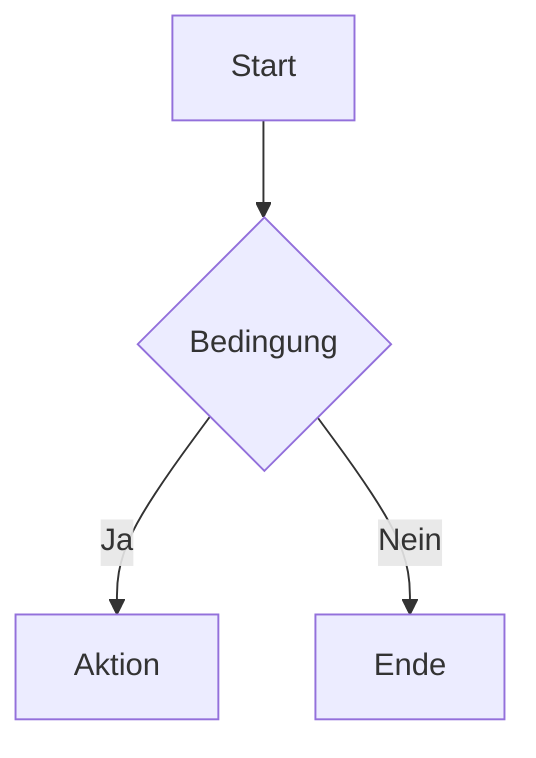

# CreateDocumentation – Skill

## Ziel
Analysiert ein übergebenes Quell-Dokument (Programm, Service-Modul oder Datenbankobjekt) vollständig und erstellt eine ausführliche, technische Dokumentation. Die Ausgabe erfolgt standardmäßig in HTML (Modal-Design) und Markdown. Über optionale Parameter kann das Ausgabeformat gesteuert werden. Bei Unklarheiten werden Rückfragen direkt während der Analyse gestellt.

---

## Parameter (Optional)

| Parameter | Verhalten |
|-----------|----------|
| *(kein)* | Standard: HTML + Markdown erstellen |
| `md` | Nur Markdown-Datei erstellen |
| `html` | Nur HTML-Datei erstellen |
| `obsidian` | Nur Obsidian-ready Markdown erstellen (Frontmatter, WikiLinks, Callouts) |

**Aufruf-Beispiele:**
```
/CreateDocumentation BOP865.SQLRPGLE
/CreateDocumentation BOP865.SQLRPGLE md
/CreateDocumentation BOP865.SQLRPGLE html
/CreateDocumentation BOP865.SQLRPGLE obsidian
```

---

## Workflow

### Schritt 1 – Dokument einlesen, Typ & Sprache erkennen

1. Das im Aufruf referenzierte Dokument vollständig einlesen
2. Quelltyp und Programmiersprache automatisch erkennen anhand von:
   - Dateiendung (`.rpgle`, `.sqlrpgle`, `.bnd`, `.table`, `.view`, `.js`, `.ts`, `.py`, `.java`, `.cs`, etc.)
   - Dateinamen-Konventionen (endet auf `_SV` → Service-Modul)
   - Syntax-Patterns und spezifische Keywords/Strukturen
3. Erkannten Quelltyp und Sprache notieren – dieser steuert welche Analyse-Abschnitte in Schritt 2 relevant sind

**Unterstützte Quelltypen (nicht limitiert):**

*IBM i / AS400:*
| Typ | Erkennungsmerkmale | Analyse-Fokus |
|-----|-------------------|---------------|
| RPGLE/SQLRPGLE (Programm) | `DCL-`, `CTL-OPT`, `EXEC SQL`, `/COPY` | Programmfluss, Prozeduren, SQL |
| Service-Modul (`_SV.SQLRPGLE`) | Dateiname endet auf `_SV`, primär `DCL-PROC`-Blöcke, kein eigenständiges Hauptprogramm | Prozedur-Katalog, Schnittstellen, SQL |
| Binder Source (`.bnd`) | `STRPGMEXP`, `EXPORT SYMBOL`, `ENDPGMEXP` | Exportierte Symbole, Signatur |
| Datenbank-Tabelle (`.table`, DDL) | `CREATE TABLE`, `PRIMARY KEY`, `IDENTITY`, `NOT NULL` | Felder, Typen, Constraints, Keys, Indizes |
| Datenbank-View (`.view`, DDL) | `CREATE VIEW`, `AS SELECT`, `JOIN` | Join-Logik, Quelltabellen, Felder |

*Weitere Sprachen:*
| Sprache | Erkennungsmerkmale | Analyse-Fokus |
|---------|-------------------|---------------|
| JavaScript/TypeScript | `function`, `const`, `import`, `=>` | Funktionen, Module, Datenfluss |
| Python | `def`, `import`, `class`, Einrückung | Klassen, Funktionen, Datenfluss |
| Java/C# | `public class`, `package`, `namespace` | Klassen, Methoden, Schnittstellen |
| SQL (Prozedur/Funktion) | `CREATE PROCEDURE`, `CREATE FUNCTION` | Parameter, Logik, Rückgabe |
| Andere | Best-Effort-Erkennung | Allgemeine Struktur |

---

### Schritt 2 – Strukturanalyse

Das Dokument systematisch analysieren. Nicht alle Abschnitte sind für jeden Quelltyp relevant – die zutreffenden Abschnitte werden basierend auf dem in Schritt 1 erkannten Typ ausgeführt:

#### 2.1 Programmfluss / Kontrollstruktur
- Einstiegspunkt(e) identifizieren
- Hauptablauf / Control-Flow dokumentieren
- Schleifen, Verzweigungen, Zustandsmaschinen
- Aufrufhierarchie (welche Prozedur ruft welche auf)

#### 2.2 Datenstrukturen / Variablen
- Globale vs. lokale Variablen
- Datenstrukturen / Klassen / Records
- Typen, Initialisierungen, Verwendungszweck

#### 2.3 SQL-Statements / DB-Zugriffe
- Alle SQL-Operationen (SELECT, INSERT, UPDATE, DELETE) mit den betroffenen Tabellen/Views
- Cursor-Verwendung (OPEN, FETCH, CLOSE) – welche Tabelle, welches Ziel
- Prepared Statements / Dynamic SQL
- Für jede SQL-Operation festhalten:
  - **Quell-Tabelle(n):** Aus welcher Tabelle stammen die Daten?
  - **Ziel-Variable(n):** In welche Felder/DS-Felder/Variablen werden die Daten geschrieben?
  - **WHERE-Bedingung:** Welche Schlüssel/Filter werden verwendet?
  - **Kontext:** Wofür wird das Ergebnis verwendet?

#### 2.4 Datenherkunft & Datenfluss *(neu – Pflichtabschnitt)*

Für **jede Variable, jeden Subfile, jede View / jedes Grid** explizit dokumentieren, woher die Daten stammen:

**Variablen-Befüllung:**
- Welche Tabelle füllt welche Variable / welches DS-Feld?
- Über welchen Key wird die Tabelle gelesen (CHAIN, READ, READE, READP, SELECT INTO)?
- Wird der Wert direkt aus einem Feld übernommen oder transformiert?

**Subfile / View / Grid-Befüllung:**
- Welche Tabelle(n) liefern die Daten für den Subfile/View?
- Wie wird der Subfile geladen (WRITE, Loop über Cursor, READNXT)?
- Welche Felder aus welcher Tabelle erscheinen im Subfile?
- Gibt es Filter oder Sortierungen?

**Dokumentations-Format pro Tabelle:**
```
Tabelle: [Tabellenname]
├── Gelesen von:    [Prozedur/Routine]
├── Über Key:       [Schlüsselfelder]
├── Füllt:          [Variable / DS-Feld / Subfile-Feld]
├── Kontext:        [Wofür werden die Daten verwendet]
└── Operation:      [CHAIN / READ / SELECT INTO / Cursor]
```

#### 2.5 Error-Handling
- Fehlerbehandlungsmuster (try/catch, MONITOR, SQLSTATE, etc.)
- Error-Codes und deren Bedeutung
- Recovery-Strategien

#### 2.6 Abhängigkeiten / Includes / Imports
- Externe Module, Libraries, Packages
- Copy-Members / Includes / Imports
- Service-Programme / Binder
- Reihenfolge und Zweck jeder Abhängigkeit

#### 2.7 Schnittstellen (Parameter, Return-Werte)
- Eingangsparameter des Programms
- Rückgabewerte
- Datenfluss zwischen Modulen

#### 2.8 Prozedur-/Funktions-Katalog
- Jede Prozedur/Funktion/Methode mit:
  - Name
  - Parameter (Typ, Richtung, Zweck)
  - Rückgabewert
  - Kurzbeschreibung der Funktion
  - Aufrufer und Aufgerufene

#### 2.9 Service-Modul-spezifische Analyse *(nur bei `_SV`-Dateien)*

Bei Service-Modulen (Dateiname endet auf `_SV` oder primär aus `DCL-PROC`-Blöcken bestehend) zusätzlich erfassen:

- **Exportierte Prozeduren:** Welche Prozeduren sind via Binder-Source nach außen sichtbar?
- **Interne Hilfsprozeduren:** Welche `DCL-PROC`-Blöcke sind nur intern (kein Export)?
- **Transaktionslogik:** Gibt es COMMIT/ROLLBACK? Unter welchen Bedingungen?
- **Logging-Prozeduren:** Gibt es zentrale Logging-Calls? Welche Parameter?
- **Initialisierung / Bereinigung:** Init- oder Cleanup-Prozeduren vorhanden?

**Dokumentationsformat pro Prozedur:**
```
Prozedur: [Name]
├── Sichtbarkeit:     [Exportiert / Intern]
├── Parameter:        [Name – Typ – Richtung (IN/OUT/CONST)]
├── Rückgabewert:     [Typ / likeds / ind / keine]
├── SQL-Zugriffe:     [Betroffene Tabellen + Art (SELECT/INSERT/UPDATE/DELETE)]
├── Fehlerbehandlung: [Mechanismus / SQLSTATE-Handling]
└── Beschreibung:     [Was tut die Prozedur?]
```

#### 2.10 Datenbankbeschreibung *(nur bei Tabellen, Views, DDL)*

Bei Datenbankobjekten (`.table`, `.view`, DDL-Dateien, SQL `CREATE`-Statements) systematisch erfassen:

**Für Tabellen:**
- **Alle Felder:** Name, Datentyp, Länge/Präzision, NULL-fähig, Default-Wert, Feldbeschreibung (LABEL ON / COMMENT)
- **Primary Key:** Felder, die den PK bilden
- **IDENTITY-Felder:** `GENERATED ALWAYS AS IDENTITY` vorhanden?
- **Foreign Keys:** Referenzen auf andere Tabellen + Beziehungstyp
- **Indizes:** Alle Indizes – Felder, Unique?, Zweck
- **Constraints:** CHECK- und UNIQUE-Constraints

**Für Views:**
- **Basis-Tabellen:** Welche Tabellen werden gejoined?
- **Join-Logik:** Typ (INNER, LEFT, RIGHT) + Join-Bedingungen
- **Feldmapping:** View-Feldname ↔ Quell-Tabelle.Quell-Feld (+ ALIAS falls vorhanden)
- **WHERE-Bedingungen:** Filter in der View-Definition
- **Verwendungszweck:** Wofür wird die View genutzt (z.B. Anzeige, Report)?

**Dokumentationsformat:**
```
Objekt: [Tabellenname / Viewname]
├── Schema:         [Bibliothek/Schema]
├── Typ:            [Tabelle / View / Materialized View]
├── Felder:         [Anzahl] Felder
├── Primary Key:    [Feldname(n)]
├── Identity:       [Feldname] (falls vorhanden)
├── Foreign Keys:   [Anzahl + Ziel-Tabellen]
└── Indizes:        [Anzahl + Unique-Indizes]
```

---

### Schritt 3 – Rückfragen bei Unklarheiten

> **PFLICHT:** Wenn während der Analyse Unklarheiten entstehen, SOFORT Rückfragen stellen.

Typische Rückfrage-Situationen:
- Unklare Variablennamen oder Abkürzungen
- Fehlender Kontext zu externen Abhängigkeiten
- Unklare Business-Logik hinter Bedingungen
- Magische Zahlen / undokumentierte Konstanten
- Unklare Datenflüsse zwischen Modulen
- Tabellenname nicht eindeutig erkennbar (Aliase, dynamische Namen)
- Unklar welche Tabelle einen Subfile / eine View befüllt
- Felder in DS deren Tabellenherkunft nicht aus dem Code ersichtlich ist

**Format der Rückfrage:**
```
⚠️ Dobby hat eine Frage zur Analyse:
[Konkrete Frage mit Verweis auf Codezeile/Abschnitt]
```

Erst nach Klärung aller Fragen zur finalen Dokumentation übergehen.

---

### Schritt 4 – Grafiken & Diagramme erstellen

Vor dem Schreiben der Dokumentation passende Diagramme erstellen. **Grafiken haben Vorrang vor reinen Text-Beschreibungen** – wenn etwas sinnvoll visualisierbar ist, wird es visualisiert.

#### Diagram-Mapping

| Inhalt | Diagrammtyp | Wann verwenden |
|--------|-------------|----------------|
| Programmfluss / Hauptablauf | **Flowchart** (`flowchart TD`) | Immer – erster Einstieg in den Ablauf |
| Prozedur-Aufrufhierarchie | **Flowchart** mit Subgraphen | Ab 3+ Prozeduren |
| Datenstrukturen / Klassen / Records | **Class Diagram** (`classDiagram`) | Wenn Felder & Typen vorhanden |
| Datenbankzugriffe / Tabellenbeziehungen | **ER Diagram** (`erDiagram`) | Wenn mehrere Tabellen betroffen |
| Datenherkunft (Tabelle → Variable/Subfile) | **Flowchart LR** | Immer – zeigt explizit welche Tabelle welche Variable/Subfile befüllt |
| Sequenz von SQL-Operationen / API-Calls | **Sequence Diagram** (`sequenceDiagram`) | Bei Cursor-Loops, mehrstufigen DB-Ops |
| Zustandsmaschinen / Status-Übergänge | **State Diagram** (`stateDiagram-v2`) | Bei expliziten Status-Feldern |
| Abhängigkeiten / Includes | **Flowchart LR** | Bei 3+ Abhängigkeiten |

#### Diagramme in Markdown (`.md`)

Mermaid-Syntax direkt einbetten:
````markdown

````

#### Diagramme in HTML (`.html`)

Mermaid.js via CDN einbinden und Diagramme als `<div class="mermaid">` rendern:

```html
<!-- Im <head> ergänzen: -->
<script src="https://cdn.jsdelivr.net/npm/mermaid@10/dist/mermaid.min.js"></script>
<script>mermaid.initialize({ startOnLoad: true, theme: 'dark',
  themeVariables: { primaryColor: '#3e4a3c', primaryTextColor: '#ddffdc',
    primaryBorderColor: '#485346', lineColor: '#7fee64',
    secondaryColor: '#212525', tertiaryColor: '#000000' } });</script>

<!-- Diagramm einbetten: -->
<div class="diagram-container">
  <div class="mermaid">
    flowchart TD
        A[Start] --> B{Bedingung}
  </div>
</div>
```

Ergänze dazu folgende CSS-Klasse im Stylesheet:
```css
.diagram-container {
  background: var(--color-carbon);
  border: 1px solid var(--color-fern);
  border-radius: 16px;
  padding: 24px;
  margin: 16px 0 24px;
  overflow-x: auto;
}
```

---

### Schritt 5 – Dokumentation erstellen

Ausgabedateien gemäß Parameter erstellen (kein Parameter = HTML + Markdown):

#### 5.1 Markdown-Datei (`[Programmname]_Dokumentation.md`) *(bei `md` oder ohne Parameter)*

Struktur:
```markdown
# [Programmname] – Technische Dokumentation

## Übersicht
- **Datei:** [Dateiname]
- **Sprache:** [Erkannte Sprache]
- **Typ:** [Programmtyp]
- **Erstellt:** [Datum]

## Programmfluss
[Mermaid Flowchart + textuelle Beschreibung]

## Datenstrukturen
[Mermaid classDiagram + Tabelle aller Felder/Typen]

## SQL / Datenbankzugriffe
[Mermaid erDiagram (wenn mehrere Tabellen) + Tabelle aller SQL-Ops mit Quell-Tabelle, Ziel-Variable und Kontext]

## Datenherkunft
[Tabellenweise Auflistung:
 - Welche Tabelle füllt welche Variable / welches DS-Feld?
 - Welche Tabelle befüllt welchen Subfile / View / Grid?
 - Mermaid flowchart: Tabelle → Variable / Subfile als Datenfluss-Diagramm]

## Error-Handling
[Fehlermuster und Recovery-Strategien]

## Abhängigkeiten
[Mermaid Flowchart LR (wenn 3+ Abh.) + Liste aller Includes/Imports]

## Schnittstellen
[Mermaid sequenceDiagram + Parameter/Rückgabe-Tabelle]

## Prozedur-Katalog
[Vollständige Tabelle aller Prozeduren/Funktionen + Aufrufhierarchie-Diagramm]
```

#### 5.2 HTML-Datei (`[Programmname]_Dokumentation.html`) *(bei `html` oder ohne Parameter)*

Verwendet das **Modal-Design** (CSS fest integriert, siehe Abschnitt "Integriertes CSS-Template") + Mermaid.js CDN für Diagramm-Rendering.

---

#### 5.3 Obsidian-Datei (`[Programmname]_Dokumentation.md`) *(nur bei Parameter `obsidian`)*

Obsidian-Markdown unterscheidet sich durch YAML-Frontmatter, WikiLinks und Callout-Blöcke. Mermaid-Diagramme werden nativ in Obsidian gerendert.

**YAML-Frontmatter (immer an den Anfang der Datei):**
```yaml
---
title: "[Programmname] – Technische Dokumentation"
aliases:
  - "[Programmname]"
  - "[Programmname] Doku"
tags:
  - dokumentation
  - [sprache]           # z.B. rpgle, sqlrpgle, javascript
  - [typ]               # z.B. programm, service-modul, tabelle, view
created: [YYYY-MM-DD]
programm: "[Programmname]"
sprache: "[Erkannte Sprache]"
typ: "[Programmtyp]"
tabellen:               # Alle referenzierten Tabellen/Views
  - "[Tabelle1]"
  - "[Tabelle2]"
includes:               # Alle Includes/Copy-Members
  - "[Include1]"
  - "[Include2]"
service_programme:      # Gebundene Service-Programme
  - "[SrvPgm1]"
---
```

**WikiLinks-Verwendung (durchgehend im Dokument):**
- Jede referenzierte Tabelle/View → `[[TabellenName]]`
- Jede Include-Datei / Copy-Member → `[[IncludeName]]`
- Jedes Service-Programm → `[[ServiceProgrammName]]`
- Verwandte Programme / Module → `[[VerwandtesProgramm]]`

**Callout-Blöcke für Hinweise:**
```markdown
> [!NOTE] Hinweis
> Text des Hinweises

> [!WARNING] Achtung
> Wichtige Warnung – z.B. bei kritischer Abhängigkeit

> [!INFO] Information
> Hintergrundinformation oder Kontext
```

**Pflicht: Verknüpfungen-Abschnitt am Ende jeder Obsidian-Datei:**
```markdown
---

## Verknüpfungen

### Referenzierte Tabellen / Views
- [[Tabelle1]] – [Kurzbeschreibung der Verwendung im Programm]
- [[Tabelle2]] – [Kurzbeschreibung der Verwendung im Programm]

### Verwendete Includes / Copy-Members
- [[Include1]] – [Zweck des Includes]
- [[Include2]] – [Zweck des Includes]

### Service-Programme
- [[ServiceProgramm1]] – [Beschreibung der Nutzung]

### Verwandte Programme / Module
- [[VerwandtesProgramm1]] – [Beziehung / Kontext]
```

---

### Schritt 6 – Qualitätsprüfung

**Allgemein (immer):**
- [ ] Quelltyp korrekt erkannt (Programm / Service-Modul / Tabelle / View)?
- [ ] Alle relevanten Analyse-Abschnitte (2.1–2.10) für den Typ ausgeführt?
- [ ] Alle Prozeduren/Funktionen im Katalog erfasst?
- [ ] Programmfluss oder Prozedur-Struktur als Flowchart visualisiert?
- [ ] Datenstrukturen als Diagramm dargestellt (wenn vorhanden)?
- [ ] DB-Zugriffe / Tabellen als ER-Diagramm (wenn mehrere Tabellen)?
- [ ] Datenherkunft dokumentiert: Welche Tabelle füllt welche Variable?
- [ ] Subfile/View/Grid-Befüllung: Quell-Tabelle(n) explizit angegeben?
- [ ] Datenfluss-Diagramm (Tabelle → Variable/Subfile) erstellt?
- [ ] Abhängigkeiten als Diagramm (wenn 3+)?
- [ ] Schnittstellen/Sequenz visualisiert (wenn sinnvoll)?
- [ ] Alle SQL-Statements dokumentiert?
- [ ] Error-Handling beschrieben?
- [ ] Schnittstellen (Ein-/Ausgabe) klar definiert?
- [ ] Keine offenen Fragen / `[KLÄREN: ...]` Marker übrig?
- [ ] Dateien im Output/-Ordner abgelegt?

**Bei Service-Modulen (Typ `_SV`):**
- [ ] Exportierte vs. interne Prozeduren unterschieden?
- [ ] Transaktionslogik (COMMIT/ROLLBACK) dokumentiert?
- [ ] Binder-Source-Symbole mit Prozedur-Katalog abgeglichen?

**Bei Datenbankobjekten (Tabelle / View):**
- [ ] Alle Felder mit Typ, Länge und NULL-fähig erfasst?
- [ ] Primary Key, IDENTITY und Foreign Keys dokumentiert?
- [ ] Indizes vollständig aufgelistet?
- [ ] Bei Views: Join-Logik und Feldmapping vollständig?

**Bei Parameter `html` oder ohne Parameter:**
- [ ] Mermaid.js CDN in HTML eingebunden?
- [ ] HTML valide und im Modal-Design?

**Bei Parameter `obsidian`:**
- [ ] YAML-Frontmatter vollständig (title, tags, tabellen, includes)?
- [ ] WikiLinks für alle Tabellen, Includes und Service-Programme gesetzt?
- [ ] Callout-Blöcke für wichtige Hinweise/Warnungen verwendet?
- [ ] `## Verknüpfungen`-Abschnitt am Ende der Datei vorhanden?
- [ ] Alle referenzierten Entitäten im Frontmatter unter `tabellen` / `includes` / `service_programme` gelistet?

---

## Ausgabe-Format

**Ablageort:** `[Projektordner]/Output/`

**Dateien (abhängig vom Parameter):**
| Parameter | Ausgabedatei(en) | Format |
|-----------|-----------------|--------|
| *(kein)* | `[Name]_Dokumentation.md` + `[Name]_Dokumentation.html` | Standard MD + Gestyltes HTML |
| `md` | `[Name]_Dokumentation.md` | Standard Markdown |
| `html` | `[Name]_Dokumentation.html` | Gestyltes HTML (Modal-Design) |
| `obsidian` | `[Name]_Dokumentation.md` | Obsidian-ready Markdown (Frontmatter + WikiLinks) |

---

## Integriertes CSS-Template (Modal-Design)

Das folgende CSS wird in jede HTML-Dokumentation eingebettet. Es basiert auf dem Design.md und muss **nicht** erneut gelesen werden.

```html
<!DOCTYPE html>
<html lang="de">
<head>
  <meta charset="UTF-8">
  <meta name="viewport" content="width=device-width, initial-scale=1.0">
  <title>[Programmname] – Technische Dokumentation</title>
  <link rel="preconnect" href="https://fonts.googleapis.com">
  <link href="https://fonts.googleapis.com/css2?family=Inter:wght@400;500;600;700&family=JetBrains+Mono:wght@400;500&display=swap" rel="stylesheet">
  <style>
    :root {
      --color-phosphor-mint: #ddffdc;
      --color-reactor-green: #7fee64;
      --color-soft-glow: #c8f9b6;
      --color-pale-mist: #def0dd;
      --color-void: #000000;
      --color-carbon: #212525;
      --color-moss: #3e4a3c;
      --color-fern: #485346;
      --color-lichen: #677d64;
      --color-stone: #859085;
      --color-bone: #ffffff;
    }

    * { margin: 0; padding: 0; box-sizing: border-box; }

    body {
      background: var(--color-void);
      color: var(--color-phosphor-mint);
      font-family: 'Inter', system-ui, -apple-system, sans-serif;
      font-size: 16px;
      line-height: 1.5;
      letter-spacing: -0.35px;
      padding: 48px 24px;
      max-width: 1200px;
      margin: 0 auto;
    }

    h1 {
      font-size: 40px;
      line-height: 1.3;
      letter-spacing: -0.6px;
      font-weight: 500;
      color: var(--color-phosphor-mint);
      margin-bottom: 32px;
      padding-bottom: 16px;
      border-bottom: 1px solid var(--color-fern);
    }

    h2 {
      font-size: 24px;
      line-height: 1.4;
      letter-spacing: -0.36px;
      font-weight: 500;
      color: var(--color-reactor-green);
      margin-top: 48px;
      margin-bottom: 16px;
    }

    h3 {
      font-size: 20px;
      line-height: 1.5;
      letter-spacing: -0.12px;
      font-weight: 500;
      color: var(--color-soft-glow);
      margin-top: 32px;
      margin-bottom: 12px;
    }

    p { margin-bottom: 16px; }

    a {
      color: var(--color-reactor-green);
      text-decoration: none;
      border-bottom: 1px solid var(--color-fern);
    }
    a:hover { border-color: var(--color-reactor-green); }

    code {
      font-family: 'JetBrains Mono', monospace;
      font-size: 14px;
      background: var(--color-carbon);
      padding: 2px 6px;
      border-radius: 4px;
      color: var(--color-soft-glow);
    }

    pre {
      background: var(--color-carbon);
      border: 1px solid var(--color-fern);
      border-radius: 16px;
      padding: 20px;
      overflow-x: auto;
      margin: 16px 0 24px;
    }
    pre code {
      background: none;
      padding: 0;
      font-size: 14px;
      line-height: 1.5;
      color: var(--color-phosphor-mint);
    }

    table {
      width: 100%;
      border-collapse: collapse;
      margin: 16px 0 24px;
    }
    th {
      background: var(--color-carbon);
      color: var(--color-reactor-green);
      font-weight: 600;
      text-align: left;
      padding: 12px 16px;
      border-bottom: 2px solid var(--color-fern);
      font-size: 14px;
      letter-spacing: -0.31px;
      text-transform: uppercase;
      letter-spacing: 0.05em;
    }
    td {
      padding: 10px 16px;
      border-bottom: 1px solid var(--color-moss);
      font-size: 14px;
      vertical-align: top;
    }
    tr:hover td { background: rgba(127, 238, 100, 0.03); }

    ul, ol {
      padding-left: 24px;
      margin-bottom: 16px;
    }
    li {
      margin-bottom: 8px;
      line-height: 1.5;
    }
    li::marker { color: var(--color-reactor-green); }

    .meta-box {
      background: var(--color-carbon);
      border: 1px solid var(--color-fern);
      border-radius: 16px;
      padding: 20px;
      margin-bottom: 32px;
    }
    .meta-box dt {
      color: var(--color-lichen);
      font-size: 12px;
      text-transform: uppercase;
      letter-spacing: 0.1em;
      margin-bottom: 4px;
    }
    .meta-box dd {
      color: var(--color-phosphor-mint);
      margin-bottom: 12px;
      font-weight: 500;
    }

    .section-divider {
      border: none;
      border-top: 1px solid var(--color-fern);
      margin: 48px 0;
    }

    .badge {
      display: inline-block;
      background: var(--color-moss);
      color: var(--color-soft-glow);
      font-size: 12px;
      padding: 4px 10px;
      border-radius: 9999px;
      font-weight: 500;
      letter-spacing: -0.31px;
    }

    .callout {
      border-left: 3px solid var(--color-reactor-green);
      padding: 12px 16px;
      background: rgba(127, 238, 100, 0.05);
      border-radius: 0 8px 8px 0;
      margin: 16px 0;
    }
  </style>
</head>
<body>
  <!-- Dokumentations-Inhalt hier -->
</body>
</html>
```

### HTML-Struktur für Sektionen

```html
<!-- Meta-Box (Übersicht) -->
<div class="meta-box">
  <dl>
    <dt>Datei</dt><dd>[Dateiname]</dd>
    <dt>Sprache</dt><dd>[Sprache]</dd>
    <dt>Typ</dt><dd>[Programmtyp]</dd>
    <dt>Erstellt</dt><dd>[Datum]</dd>
  </dl>
</div>

<!-- Sektion -->
<h2>Sektionsname</h2>
<p>Beschreibung...</p>

<!-- Code-Block -->
<pre><code>[Code hier]</code></pre>

<!-- Prozedur-Tabelle -->
<table>
  <thead>
    <tr><th>Prozedur</th><th>Parameter</th><th>Rückgabe</th><th>Beschreibung</th></tr>
  </thead>
  <tbody>
    <tr><td>...</td><td>...</td><td>...</td><td>...</td></tr>
  </tbody>
</table>

<!-- Callout für wichtige Hinweise -->
<div class="callout">
  <p><strong>Hinweis:</strong> [Wichtiger Kontext]</p>
</div>
```
